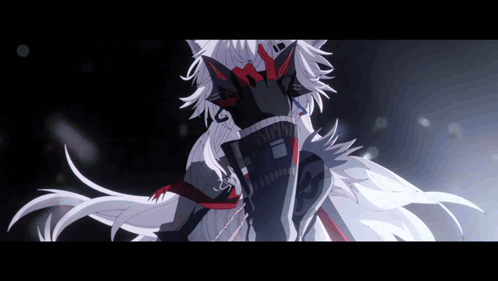

<!-- TOP BANNER WITH LAPPLAND -->

  

<h1 align="center">🐺 Hi there, I'm Nethrune! 🐺</h1>

  <b>Developer • Programmer • Student</b>

  

---

<h3 align="center">🛠️ Tech Stack</h3>

  
  
  
  
  

  
  
  

---

<h3 align="center">📬 Connect with Me</h3>

  
  

