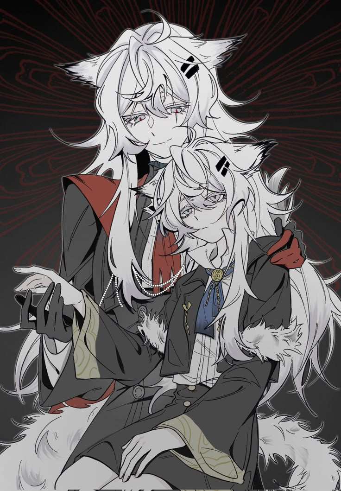
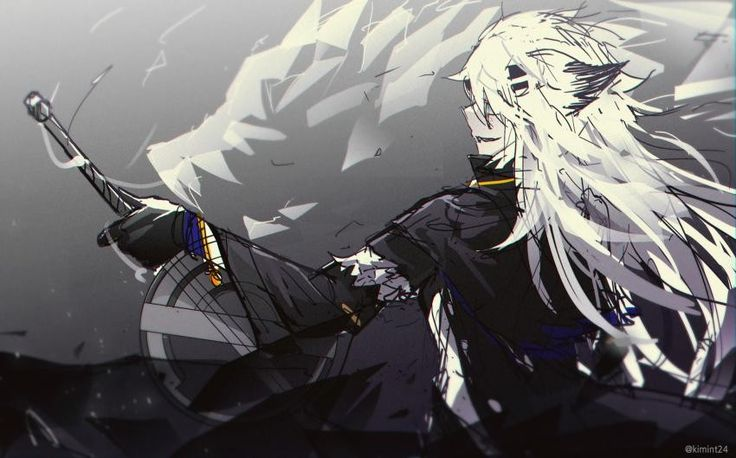
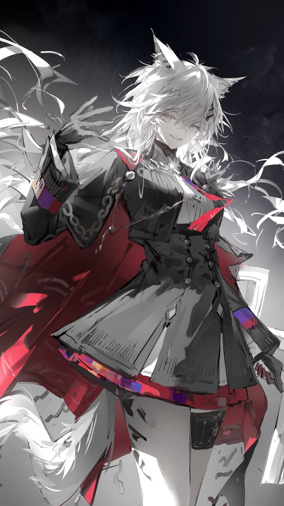
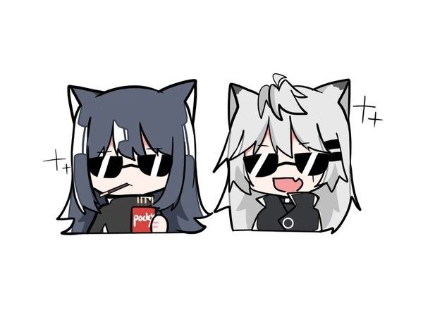
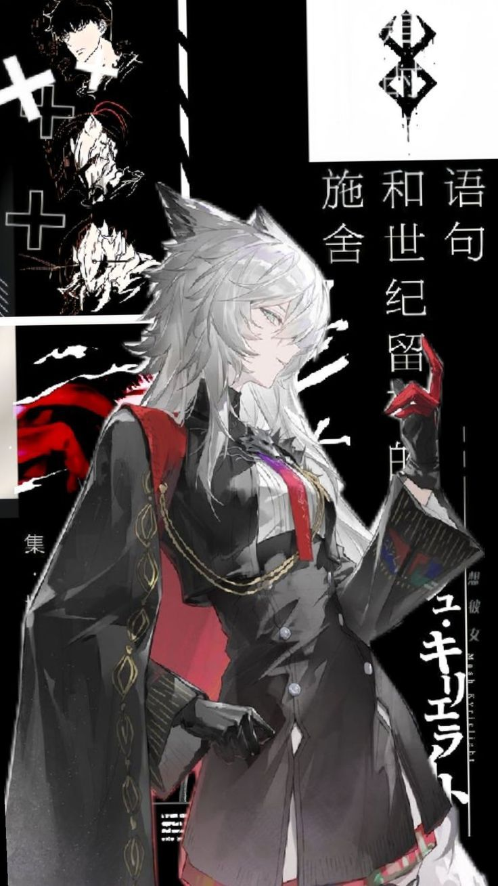

<!-- CENTRAL BANNER WITH LAPPLAND -->

<h1 align="center">🐺 Hi there, I'm Nethrune! 🐺</h1>

---

<!-- SECTION 1: ABOUT ME WITH ART -->
<table width="100%" border="0" cellpadding="10" cellspacing="0">
<tr>
<td width="65%" valign="top">
<h2>🎭 About Me</h2>
<blockquote>
⚠️ <b>CRITICAL DECLARATION:</b> 
<b>Lappland is my official and lawful wife.</b> Hands off, do not claim her. No further questions will be entertained. ⚔️🐺
</blockquote>
<ul>
<li>👦 <b>Age:</b> 16 years old. Young, passionate, and fueled by programming and engineering.</li>
<li>🎬 <b>Interests:</b> Massive fan of cinema, TV shows, anime (Arknights dominates my heart), and a hardcore <b>Sci-Fi</b> geek.</li>
<li>⚙️ <b>Philosophy:</b> Bridging the gap between clean software, hardware engineering, and a healthy dose of madness.</li>
</ul>
</td>
<td width="35%" valign="middle" align="center">

</td>
</tr>
</table>

---

<!-- SECTION 2: 3D MODELING WITH ART -->
<table width="100%" border="0" cellpadding="10" cellspacing="0">
<tr>
<td width="50%" valign="top">
<h2>📐 3D Modeling & Engineering</h2>

Aside from writing code, I deeply explore <b>3D modeling</b>, <b>robotics</b>, <b>electronics</b>, and <b>aerospace engineering</b>.

I love conceptualizing mechanics and bringing them to life through hardware design and beautiful spatial renders before deployment.

</td>
<td width="50%" valign="middle" align="center">

</td>
</tr>
</table>

---

<!-- SECTION 3: HORIZONTAL COMPACT DASHBOARD -->
<table width="100%" border="0" cellpadding="10" cellspacing="0">
<tr>
<!-- COL 1: TECH STACK TEXT -->
<td width="32%" valign="top">
<h2>🛠️ Tech Stack</h2>

<b>💻 Languages:</b> 

  
<b>🌐 Web & DB:</b> 

  
<b>🚀 Engineering:</b> 

  
<b>🎨 3D Design:</b> 

</td>

<!-- COL 2: TECH STACK ART -->
<td width="18%" valign="middle" align="center">

</td>

<!-- COL 3: CONNECT TEXT & CHIBI -->
<td width="32%" valign="top" align="center">
<h2>📬 Connect with Me</h2>

 

  

<i>"Haha... Let's see how long your code can last!" — Lappland</i>

</td>

<!-- COL 4: CONNECT ART -->
<td width="18%" valign="middle" align="center">

</td>
</tr>
</table>
